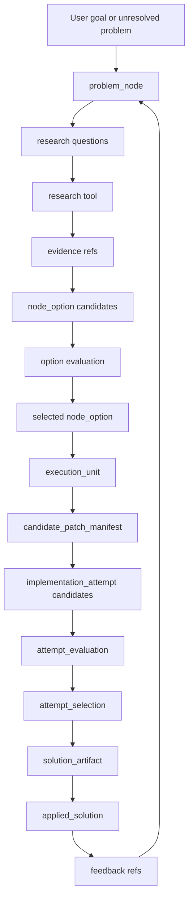

# Project Format And State V1

## Purpose

This document is the navigation contract for the current platform build.

It explains:

- where project objects live
- how tools interact
- which objects are buildable
- what is implemented now
- what remains planned

If another document or tool needs a different project shape, update this document and the relevant contracts together.

## Current State

Implemented:

- `problem_node` contract
- `node_option` contract
- `execution_unit` contract
- registry entries for the three contracts
- contract tests proving selected solution scopes are not execution units
- design-iteration validation over current planning graphs
- implementation intent propagation from research candidates to recommendations and selected scopes
- node readiness policy and validator
- execution-unit materializer for selected scopes with implementation intent
- execution ERA contracts for attempts, attempt evaluations, and solution artifacts
- implementation attempt generator
- patch-producing implementation attempts
- patch-aware attempt evaluator
- solution artifact emitter
- execution ERA smoke loop through patch-bearing solution artifacts
- attempt selection contract
- deterministic multi-attempt selector
- execution ERA smoke loop through multi-attempt selection
- candidate patch manifest contract
- deterministic multi-patch manifest materializer
- manifest-backed implementation attempt generation
- manifest-backed execution ERA smoke loop

Partially implemented:

- research candidate generation
- research recommendation generation
- selected solution scope materialization
- design-iteration review mode
- plan-quality scoring
- research-to-selection validation

Planned next:

- richer attempt generation and patch synthesis
- current-worktree apply policy

Not implemented yet:

- universal packet schema validator at every tool boundary
- current-worktree apply executor
- full graph reranking loop

## Repository Layout

`docs/`

- human-readable design specs, flow explanations, and tool responsibilities

`spec/contracts/`

- packet schemas and the packet schema registry
- this is the authority for required fields and packet ownership

`artifacts/planner/research/`

- machine-readable DAGs, planning graphs, and design artifacts

`.agent/execplans/`

- implementation plans that Codex or workers can execute
- each exec plan should name owned files, validation commands, source artifacts, and acceptance criteria

`src/platform_tools/`

- Python implementations of local tools and materializers

`bin/`

- CLI entrypoints for tools

`tests/`

- contract, tool, and flow validation tests

`artifacts/validation/`

- validation reports and review outputs

## Canonical Object Model

```text
project
  -> project_problem_graph
  -> problem_node[]
  -> node_option[]
  -> execution_unit[]
  -> candidate_patch_manifest[]
  -> implementation_attempt[]
  -> attempt_evaluation[]
  -> attempt_selection[]
  -> solution_artifact[]
  -> applied_solution[]
  -> feedback/provenance refs
```

The platform is graph-first.

A project is not a single plan blob. A project is a DAG of manageable problem nodes and their derived work contracts.

## Object Responsibilities

### `problem_node`

Owner:

- `planner-tool`

Purpose:

- represent one manageable project problem in a larger graph

Status:

- implemented as a contract

Buildability:

- not buildable

Required concepts:

- goal
- problem statement
- constraints
- dependencies
- evidence refs
- option refs
- selected option ref
- readiness state
- missing fields
- evaluation criteria
- feedback refs

### `node_option`

Owner:

- `planner-tool`
- may be produced with research-tool assistance

Purpose:

- represent one candidate way to solve or advance a problem node

Status:

- implemented as a contract
- implementation-intent strictness is the next slice

Buildability:

- not buildable

Required concepts:

- source node ref
- option family
- approach summary
- implementation intent
- expected changes
- non-goals
- assumptions
- risks
- evidence refs
- evaluation refs

### `execution_unit`

Owner:

- `planner-tool`

Purpose:

- represent one buildable and evaluable work contract derived from a selected node option

Status:

- implemented as a contract
- runtime materialization is planned

Buildability:

- buildable

Required concepts:

- source problem node ref
- selected option ref
- implementation intent
- owned changes
- required inputs
- expected outputs
- acceptance checks
- validation commands
- rollback plan
- dependency refs
- evidence refs
- evaluation method
- completion evidence requirements

### `implementation_attempt`

Owner:

- implementation orchestrator

Purpose:

- represent one candidate implementation for an execution unit

Status:

- implemented

Buildability:

- generated inside an execution-unit boundary
- may carry a patch artifact in `patch_ref`

### `candidate_patch_manifest`

Owner:

- implementation orchestrator
- future patch synthesis tools

Purpose:

- carry multiple artifact-backed candidate patches for one execution unit before attempt generation

Status:

- implemented

Required concepts:

- source execution unit ref
- candidate patch refs
- candidate ids
- candidate families
- source labels
- expected changed artifact refs
- validation refs
- candidate blockers
- manifest blockers

### `attempt_evaluation`

Owner:

- governance-tool or evaluation runner

Purpose:

- evaluate one implementation attempt against tests, review checks, acceptance criteria, and evidence

Status:

- implemented

Required concepts:

- source attempt ref
- source execution unit ref
- validation results
- review findings
- blockers
- evidence refs
- promotion status

### `attempt_selection`

Owner:

- implementation orchestrator

Purpose:

- choose one evaluated implementation attempt from a candidate set using deterministic evidence-backed scoring

Status:

- implemented

Required concepts:

- source execution unit ref
- selected attempt ref
- selected evaluation ref
- rejected attempt refs
- rejected evaluation refs
- candidate score breakdown
- selection policy ref
- evidence refs
- blockers

### `solution_artifact`

Owner:

- implementation orchestrator

Purpose:

- record the selected implementation attempt and completion evidence

Status:

- implemented

Required concepts:

- selected attempt ref
- evaluation ref
- artifact refs
- patch ref
- completion evidence refs
- known limitations

### `applied_solution`

Owner:

- executor
- governed by governance-tool policy gates

Purpose:

- record that a promoted solution artifact was applied in an isolated target and validated

Status:

- implemented

Required concepts:

- source solution artifact ref
- source execution unit ref
- selected attempt ref
- evaluation ref
- patch ref
- apply target ref
- apply result ref
- validation result refs
- applied artifact refs
- blockers

## Tool Interaction Model



## Tool Boundaries

### Design tool

Responsibilities:

- clarify problem shape
- route questions to research
- review graph and contract drift
- produce critique findings and follow-up questions

Must not:

- silently approve implementation
- invent missing contract fields

### Research tool

Responsibilities:

- generate research questions
- search and record evidence
- produce candidate options
- preserve source provenance

Must not:

- treat evidence-free recommendations as implementation-ready
- collapse rejected sources or rejected candidates out of the trace

### Planner tool

Responsibilities:

- manage project DAGs
- rank problem nodes
- generate or select node options
- materialize execution units after readiness gates pass

Must not:

- build code
- treat selected solution scopes as execution units

### Governance tool

Responsibilities:

- validate packets against contracts
- enforce readiness gates
- block illegal transitions
- preserve auditability

Must not:

- redefine planner intent
- fill missing implementation semantics from prose

### Executor

Responsibilities:

- consume execution units
- generate implementation attempts
- run validation commands
- emit solution artifacts
- apply promoted solution artifacts inside governed boundaries

Must not:

- execute problem nodes directly
- execute node options directly
- claim completion without validation evidence
- mutate the source worktree unless an explicit current-worktree apply policy allows it

## Readiness Ladder

Problem nodes move through these states:

```text
draft
research_ready
option_generation_ready
selection_ready
planning_ready
implementation_ready
evaluation_ready
complete
blocked
```

Readiness controls tool legality.

Example:

- `research_ready` allows research.
- `selection_ready` allows option selection.
- `implementation_ready` requires an execution unit.
- `complete` requires completion evidence.

## Anti-Drift Rules

The following are hard rules:

- `problem_node` is not executable.
- `node_option` is not executable.
- `selected_solution_scope` is not executable.
- `execution_unit` is the first buildable object.
- candidate options must carry implementation intent before they can feed execution-unit materialization.
- governance validates and blocks; it does not repair missing semantics.
- executor selects implementation attempts through evaluation, not narrative preference.
- attempt selection is evidence-backed and deterministic; blocked evaluations are ineligible.
- candidate diversity must be artifact-backed before selection can claim candidate search value.
- applying a solution artifact is a separate governed transition after solution emission.
- default apply mode must use an isolated target and post-apply validation.

## Current Validation Commands

Contract validation:

```bash
uv run pytest tests/test_problem_node_execution_unit_contracts.py
```

Design validation:

```bash
bin/design-iteration --root .
```

Problem-node contract DAG validation:

```bash
python3 -m json.tool artifacts/planner/research/problem-node-execution-unit-contract-v1-dag.json
```

## Build Sequence From Here

### Step 1: Implementation-Intent Candidate Contract

Goal:

- ensure research candidates include implementation-specific intent instead of generic family labels

Outputs:

- stricter candidate fields
- intent propagation into recommendations
- selected solution scopes carrying selected candidate intent
- tests proving generic candidates are not sufficient

Status:

- implemented

### Step 2: Node Readiness Validator

Goal:

- validate whether a problem node can legally advance to the next state

Outputs:

- readiness checks
- missing-field reports
- blocker packets

Status:

- implemented

### Step 3: Execution-Unit Materializer

Goal:

- turn a selected node option into a concrete execution unit

Outputs:

- execution-unit packet
- owned changes
- validation commands
- rollback plan

Status:

- implemented

### Step 4: Execution ERA Contracts

Goal:

- formalize implementation attempts, attempt evaluations, and solution artifacts

Outputs:

- `implementation_attempt` contract
- `attempt_evaluation` contract
- `solution_artifact` contract

Status:

- implemented

### Step 5: End-To-End Workflow Smoke Test

Goal:

- run one complete path from problem node to selected implementation-ready execution unit

Outputs:

- machine-readable artifacts
- validation report
- unresolved findings

Status:

- implemented for execution-unit to patch-bearing solution-artifact packet flow

### Step 6: Governed Apply Solution Artifact

Goal:

- turn a promoted solution artifact into an applied and validated repository change without uncontrolled mutation

Outputs:

- `applied_solution` contract
- isolated apply executor
- apply result evidence
- post-apply validation evidence

Status:

- implemented

### Step 7: Multi-Attempt Selection

Goal:

- evaluate multiple implementation attempts and select one candidate before solution artifact emission

Outputs:

- `attempt_selection` contract
- deterministic selector
- multi-attempt smoke-loop integration

Status:

- implemented

### Step 8: Candidate Patch Manifest

Goal:

- provide deterministic multi-patch candidate ingestion before implementation attempt generation

Outputs:

- `candidate_patch_manifest` contract
- materializer CLI
- manifest-backed attempt generation
- manifest-backed smoke-loop integration

Status:

- implemented

## Source Basis

Current source-backed design claims are grounded in:

- AlphaEvolve for generate/evaluate/select candidate search: https://arxiv.org/abs/2506.13131
- SWE-bench for concrete repository task grounding: https://arxiv.org/abs/2310.06770
- CRITIC for tool-grounded critique: https://arxiv.org/abs/2305.11738
- Reflexion for retaining feedback signals: https://arxiv.org/abs/2303.11366
- W3C PROV-DM for provenance and derivation links: https://www.w3.org/TR/prov-dm/

## Current Critical Risk

The biggest remaining drift risk is apply-state drift.

The system can now generate implementation-specific candidates, select a scope, validate readiness, materialize an execution unit, generate patch-bearing attempts, evaluate one or more attempts, select among attempts, emit solution artifacts, and apply selected solutions in isolated targets.

The next missing boundary is autonomous candidate generation:

- synthesized patch attempts
- diverse candidate families
- larger tree search over options

The system can now rank genuinely different supplied patch artifacts. Without the next boundary, candidate diversity still depends on humans or external tools supplying patch candidates rather than platform-generated patches.
