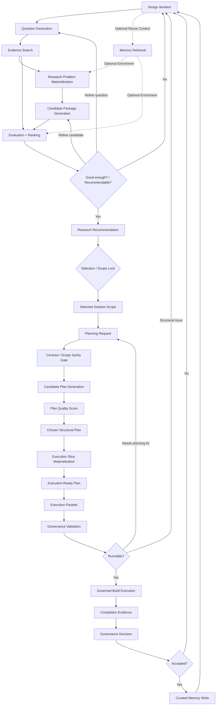
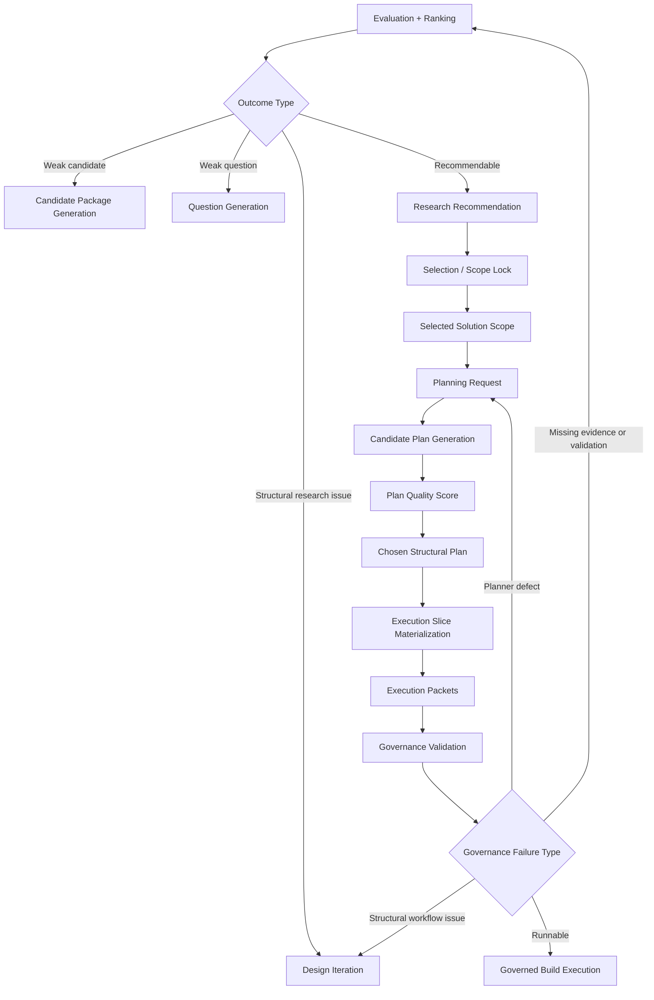

# System Flow Mermaid

## Objective

Provide a clear system-flow view of the toolchain so orchestration and implementation can proceed with shared understanding.

This document is meant to make the staged graph explicit:

- what happens in what order
- where feedback loops occur
- what tool owns each stage
- what artifacts become canonical at each handoff

## High-Level Flow

## Stage Ownership

### `Design Iteration`

Owner:

- `design-iteration-tool`

Purpose:

- identify contradictions, drift risks, gaps, and next problem areas

Primary outputs:

- `design_findings_packet`
- `design_gap_packet`
- `next_question_candidate_packet`

Canonical output:

- bounded design findings and gap framing

### `Question Generation`

Owner:

- `question-tool`

Purpose:

- turn project context and design gaps into bounded research questions

Primary outputs:

- `research_question_packet`

Canonical output:

- bounded question contract for downstream research

### `Evidence Search`

Owner:

- `evidence-search-tool`

Purpose:

- retrieve external papers, docs, benchmarks, and evidence refs

Primary outputs:

- `evidence_packet`

Canonical output:

- normalized external evidence for the current question/problem

### `Memory Retrieval`

Owner:

- `memory-tool`

Purpose:

- retrieve reusable internal solved-case records and artifacts

Primary outputs:

- memory context refs
- ranked reusable records

Canonical output:

- reusable internal context only, not authoritative workflow state

Usage rule:

- optional by default
- invoked when reuse is likely or useful
- not a mandatory upstream dependency for every research run

### `Research Problem Materialization`

Owner:

- shared transform contract or `research-tool` boundary layer

Purpose:

- turn question, evidence, and memory context into the exact bounded research input

Primary outputs:

- `research_problem_packet`

Canonical output:

- research-tool input contract

### `Candidate Package Generation`

Owner:

- `research-tool`

Purpose:

- generate candidate solution packages, which may include design, contract, code, and reuse posture elements

Primary outputs:

- `research_candidate_packet[]`

Canonical output:

- candidate solution set, still non-authoritative

Internal note:

- the package may include separately managed subcomponents such as design candidates, contract candidates, or code candidates
- those internals do not need to appear as separate universal top-level orchestration stages

### `Evaluation + Ranking`

Owner:

- `research-tool`

Purpose:

- evaluate candidate artifacts and rank them using explicit scoring

Primary outputs:

- `research_evaluation_packet[]`
- `ranked_candidate_packet[]`
- `research_recommendation_packet`

Canonical output:

- ranked recommendation, but not yet final build authority

### `Research Recommendation`

Owner:

- `research-tool`

Purpose:

- emit the ranked recommendation from the research loop

Primary outputs:

- `research_recommendation_packet`

Canonical output:

- recommendation only, not final build authority

### `Selection / Scope Lock`

Owner:

- runner-configurable gate

Purpose:

- convert recommendation into authoritative selected scope

Primary outputs:

- gate decision
- selected scope materialization trigger

Canonical output:

- selection decision for downstream planning

Usage rule:

- human by default early on
- may later be governance-backed in narrower workflows

### `Selected Solution Scope`

Owner:

- shared research-to-planner handoff contract

Purpose:

- establish the authoritative selected solution for planning

Primary outputs:

- `selected_solution_scope`

Canonical output:

- authoritative solution-selection contract for downstream planning

### `Planning Request`

Owner:

- `planner-tool` intake boundary

Purpose:

- convert selected solution scope into planner-ready request semantics

Primary outputs:

- `planning_request_packet`

Canonical output:

- candidate-plan generation input

### `Contract / Scope Sanity Gate`

Owner:

- light runner or governance-adjacent sanity gate

Purpose:

- reject malformed plan requests before candidate plan generation

### `Candidate Plan Generation`

Owner:

- `planner-tool`

Purpose:

- generate one or more valid candidate implementation plans for the same selected solution scope

Primary outputs:

- candidate `implementation_plan` or `implementation_graph_packet` refs

Canonical output:

- valid candidate plans, not yet the chosen build plan

### `Plan Quality Score`

Owner:

- `plan-quality-score`

Purpose:

- compare valid candidate plans and rank them under plan-quality policy

Primary outputs:

- `plan_quality_score_packet[]`
- `ranked_plan_packet`

Canonical output:

- ranked valid plans for the same selected solution scope

### `Chosen Structural Plan`

Owner:

- runner-configurable plan selection gate

Purpose:

- materialize the winning structural plan after plan-quality comparison

Canonical output:

- chosen structural plan for downstream execution-slice materialization

### `Execution Slice Materialization`

Owner:

- `planner-tool` or implementation-planner phase

Purpose:

- convert the chosen structural plan into governance-facing runnable units

Primary outputs:

- materialized execution-slice set
- execution-ready plan ref

Canonical output:

- execution-ready plan semantics, not raw structural planning only

### `Execution-Ready Plan`

Owner:

- downstream planner materialization boundary

Purpose:

- hold the chosen plan after execution slices, runnable preconditions, and completion evidence requirements have been attached

Canonical output:

- the only supported planning artifact for execution-packet emission and governance intake

### `Execution Packets`

Owner:

- `planner-tool`

Purpose:

- project runnable slices from the execution-ready plan

Primary outputs:

- `execution_packet[]`

Canonical output:

- planner-to-governance runnable contracts

### `Governance Validation`

Owner:

- `governance-tool`

Purpose:

- validate legality, approvals, validations, and runnable state

Primary outputs:

- `validation_result_packet`
- `runnable_state_packet`

Canonical output:

- explicit governance status for proposed execution

### `Governed Build Execution`

Owner:

- orchestration runner plus execution environment

Purpose:

- actually run the approved build work

Primary outputs:

- produced artifacts
- validation outputs
- execution traces

Canonical output:

- completion artifacts and run evidence

### `Completion Evidence`

Owner:

- execution environment plus governance-facing packaging

Purpose:

- package evidence needed to prove completion or merge readiness

Primary outputs:

- completion evidence refs

Canonical output:

- explicit completion-evidence packet set

### `Governance Decision`

Owner:

- `governance-tool`

Purpose:

- decide whether the work is accepted, blocked, or needs more action

Primary outputs:

- `governance_decision_packet`

Canonical output:

- authoritative legality/readiness decision

### `Curated Memory Write`

Owner:

- `memory-tool`

Purpose:

- store reusable solved-case knowledge only after usefulness is demonstrated

Primary outputs:

- curated records and links

Canonical output:

- reusable internal memory, not execution state

Downstream use:

- feeds future research reuse
- feeds future design-iteration context

## Canonical Handoff Rules

### Research To Planner

- `research_recommendation_packet` is not enough
- `selected_solution_scope` is required

### Planner To Governance

- `execution_packet` is required
- governance must not reconstruct missing planner semantics

### Governance To Memory

- only accepted or materially useful results should be curated
- memory write is late, not default write-through

## Feedback Loops

This system is intentionally iterative.

### Research Failure Loop

If research ranking does not produce a good enough candidate:

- refine candidate generation
- refine the question
- or return to design iteration

### Planning Failure Loop

If planning reveals scope ambiguity or decomposition failure:

- refine selected solution scope
- or return to design iteration

### Governance Failure Loop

If governance blocks execution:

- fix planner outputs
- fix required evidence
- or return to design iteration if the issue is structural

### Memory Learning Loop

Once a good result is accepted:

- curate only the reusable and proven parts
- use them later during memory retrieval
- use them later during design iteration

## Non-Linear Truth

The system is not a strict pipeline.

It is a bounded staged graph with:

- forward progress
- local refinement loops
- explicit selection gates
- explicit authority handoffs

That is the shape the orchestration runner should eventually support.

## Implementation Guidance

When building orchestration:

- use this graph as the conceptual substrate
- keep the first actual runner workflow smaller than the full map
- lock canonical handoffs before building tool extraction

## First Runner Slice

The first actual orchestration workflow should likely stop here:

1. `Question Generation`
2. `Evidence Search`
3. `Research Problem Materialization`
4. `Candidate Package Generation`
5. `Evaluation + Ranking`

Optionally:

6. `Selection / Scope Lock`
7. `Selected Solution Scope`

This is a compressed operational projection of the fuller architecture.

It intentionally proves:

- question handoff
- evidence integration
- research evaluation and ranking
- selected-solution materialization

before planner and governance execution phases are introduced.

## Failure-Loop View

